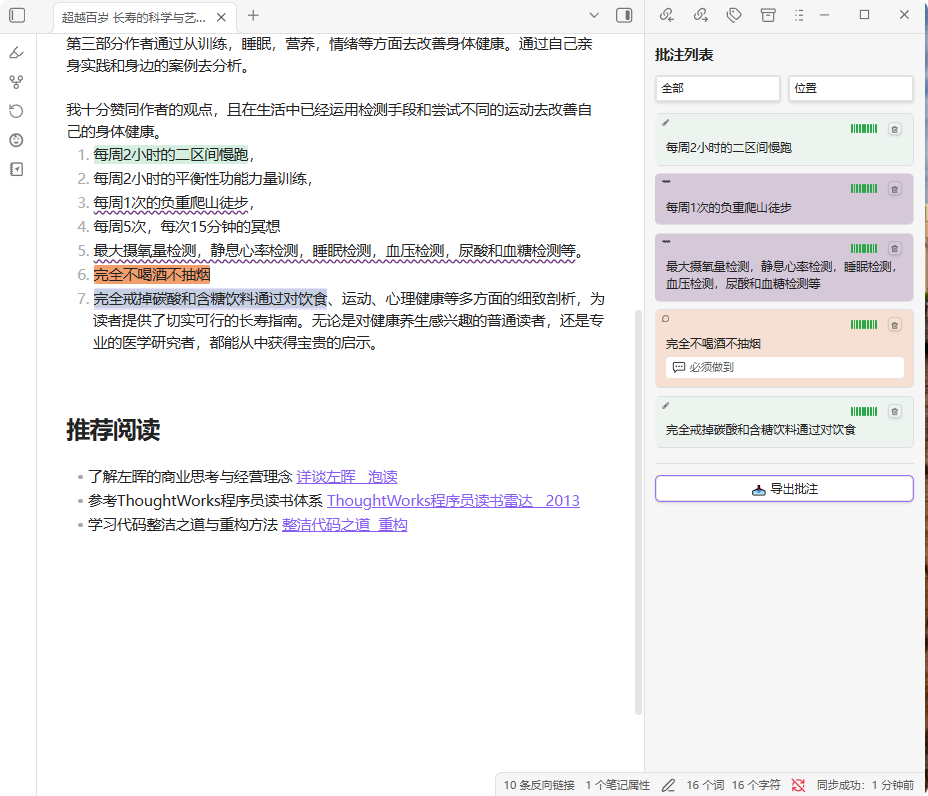

<p align="center">
  
</p>

<h1 align="center">MDAnnot</h1>

<p align="center">
  <strong>在 Markdown 上留下你的阅读痕迹——高亮、划线、评论，不改原文。</strong>
</p>

<p align="center">
  <a href="https://obsidian.md">
    
  </a>
  <a href="https://github.com/yourname/md-annot/releases">
    
  </a>
  <a href="LICENSE">
    
  </a>
</p>

---

## 概览

**MDAnnot** 是一个 Obsidian 社区插件，让你在阅读 Markdown 文档时，可以直接在文字上做标注——**高亮**关键词句、**划线**标记、**评论**写下思考——批注独立存储，不修改 `.md` 原文。

### 特点

| | 说明 |
|---|---|
| 📄 **不污染源文** | 批注数据独立存储在 `.annotations/` 目录，不修改 `.md` 原文，随 vault 同步 |
| 📋 **批注列表** | 右侧面板集中管理当前文档所有批注，支持按类型筛选、按位置排序 |
| 📍 **批注定位** | 点击任意批注卡片自动滚动到文档中对应文字位置，橙色呼吸闪烁动画提示 |
| 📊 **匹配度识别** | 每条批注显示锚定状态标签（精确/模糊/段落/丢失）和 10 格彩色进度条 |
| 🎨 **颜色配置** | 12 种预设色卡快速选色，高亮、划线、评论三种颜色独立配置 |
| 📤 **导出批注** | 支持导出当前文档批注和所有文档批注为 Markdown 格式 |

---

## 核心功能

### 编辑和阅读模式批注

| 操作 | 视觉 | 说明 |
|------|------|------|
| **高亮** | 绿色背景标记 | 突出关键信息 |
| **划线** | 蓝色波浪下划线 | 标记需要关注的词句 |
| **评论** | 黄色背景 + 评论文本 | 定位文字并附加详细笔记 |

编辑模式选中文字弹出浮动工具栏，阅读模式下选中文字同样弹出工具栏，渲染效果一致。批注密集区域按钮自动高亮已有批注，点击即 toggle 覆盖/删除。

### 文本锚定引擎

批注位置基于**文本内容指纹**（FNV-1a 哈希 + 上下文）定位，编辑文档后四级降级匹配：

```
精确匹配(EXACT) → 模糊匹配(FUZZY) → 段落匹配(PARAGRAPH) → 标记丢失(LOST)
```

每条批注自动计算匹配度，侧面板显示 10 格彩色进度条，绿→黄→橙→红渐变，一眼判断锚定状态。

### 批注列表面板

- **筛选**：按全部/高亮/划线/评论过滤
- **排序**：按位置/高亮在前/评论在前
- **匹配度**：锚定状态标签 + 彩色置信度进度条
- **定位**：点击卡片 → 自动滚动到文档对应位置 + 橙色呼吸闪烁
- **删除**：一键删除对应批注
- **导出**：当前文档批注导出为 Markdown

### 设置面板

- **显示控制**：全局批注开关（关闭时清除所有渲染）、自动显示面板
- **颜色设置**：高亮/划线/评论三种颜色独立配置，3×4 色卡弹窗快速选色
- **颜色渲染模式**：全局统一颜色 vs 每个批注保留历史颜色
- **数据存储**：清空所有批注数据（到废纸篓）、清理失效缓存
- **导出所有批注**：遍历所有有批注的文档，按文档分组导出

---

## 安装

### 手动安装

1. 在 Obsidian 中打开 **设置 → 社区插件 → 浏览**
2. 搜索 **MDAnnot**，点击安装
3. 启用插件

### BRAT安装

1. 安装 [BRAT](https://obsidian.md/plugins?id=obsidian42-brat) 插件
2. 在 BRAT 设置中添加该链接

### 手动下载

1. 下载 `main.js`、`manifest.json`、`styles.css`
2. 放入 `你的笔记库/.obsidian/plugins/md-annot/`
3. 重新加载 Obsidian 并启用插件

---


## 技术栈

| 维度 | 方案 |
|------|------|
| 语言 | TypeScript 5.x |
| 编辑器 | CodeMirror 6（Obsidian 封装） |
| 锚定算法 | FNV-1a 哈希 + Levenshtein 编辑距离 |
| 存储 | `.obsidian/md_annot` 目录 JSON 文件 |
| 外部依赖 | 无（零 API / 零数据库 / 零 SDK） |
| 测试 | Vitest（24 个测试用例） |

## 多设备同步批注信息

所有设备需要安装此插件，借助Remotely Save的能力，开启 【同步配置文件夹】
