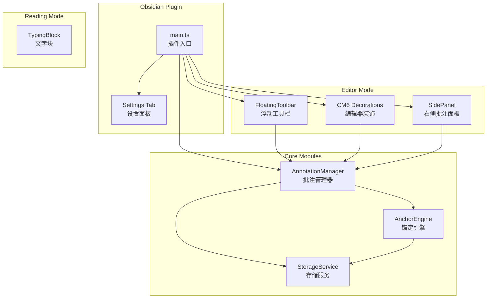
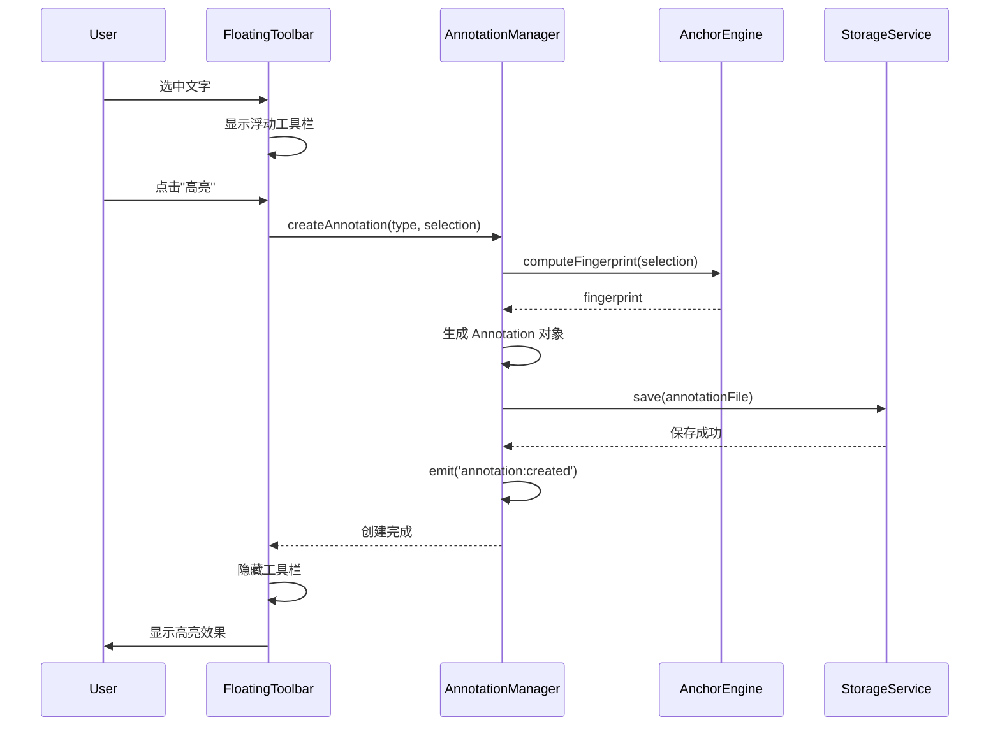
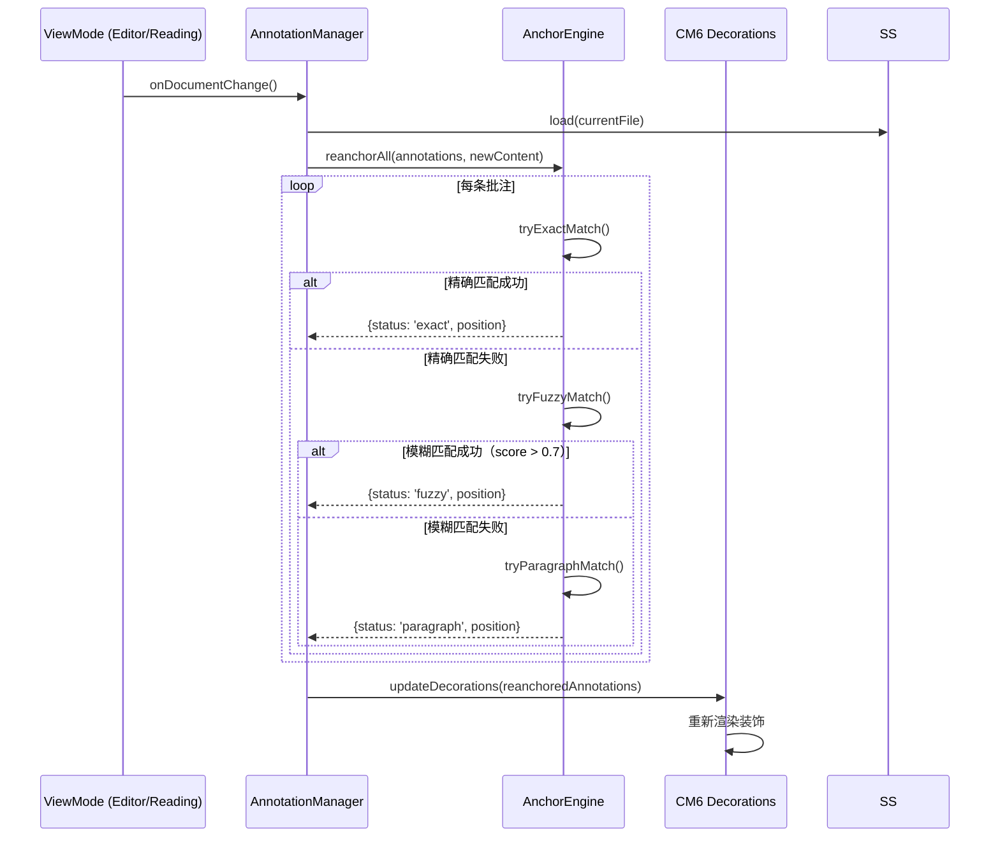

---
tags:
  - 思考
  - 学习
  - 工作
  - "#项目"
  - "#MDAnnot"
---

> 标签: #思考 #学习 #工作

# MDAnnot 技术方案设计文档

## 1. 项目概述

### 1.1 背景与价值

**业务背景**
笔记已全面迁移到 Obsidian，但在阅读 `.md` 文件时存在以下痛点：
- 现有批注插件只支持 PDF，不支持 Markdown
- 阅读时需要在特定文字上划线/画圈/高亮/写批注来帮助记忆和关联

**项目价值**
- 提升 Markdown 笔记的阅读体验和学习效率
- 实现"所见即所注"的沉浸式阅读批注
- 完全离线运行，保护用户隐私
- 零外部依赖，安装即用

### 1.2 项目目标

**核心目标**
- 在 Markdown 文档上叠加批注层
- 批注锚定到文本内容，不破坏 `.md` 原文
- 支持编辑模式（文字批注）和阅读模式

**成功标准**
- 批注数据独立存储，不影响原始 Markdown 文件
- 编辑后批注能正确锚定（模糊匹配降级）
- 跨平台兼容（macOS/Windows/iPad/Android）

**非功能性目标**
- 零外部依赖，完全离线运行
- 批注文件体积小，支持同步

## 2. 范围与约束

### 2.1 功能范围

| 优先级 | 功能 | 说明 |
|--------|------|------|
| P0 | 编辑模式批注 | 划线、高亮、文字批注 |
| P0 | 文本锚定 | 基于内容指纹的锚定算法 |
| P0 | 批注存储 | `.annotations/` 目录结构 |
| P0 | 右侧批注面板 | 列表、筛选、跳转、删除 |

| P1 | 锚定降级 | exact → fuzzy → paragraph → lost |
| P2 | 导出 Markdown | 批注导出为 MD 文件 |
| P2 | 设置面板 | 样式、存储、同步选项 |

### 2.2 技术约束

| 约束类型 | 说明 |
|----------|------|
| 运行环境 | Obsidian 桌面端（Electron）+ 移动端 |
| 构建工具 | esbuild（Obsidian 官方推荐） |
| 编辑器 | CodeMirror 6（Obsidian 默认） |
| 存储 | Obsidian Vault 文件系统 |
| 依赖 | 零第三方库，完全自包含 |

## 3. 架构设计

### 3.1 系统架构



### 3.2 技术栈选择

| 维度 | 选择 | 理由 |
|------|------|------|
| 语言 | TypeScript | Obsidian 插件唯一选择，类型安全 |
| 构建 | esbuild | Obsidian 官方推荐，构建速度快 |

| 编辑器装饰 | `Plugin.registerEditorExtension()` | Obsidian 对 CM6 的封装 |
| 存储 | `app.vault.adapter` 读写 JSON | 透明、可随文档同步 |
| 状态管理 | 自研轻量级 EventEmitter | 避免引入外部状态库 |

### 3.3 核心组件职责

```
┌─────────────────────────────────────────────────────────────┐
│                     MDAnnot Plugin                          │
├─────────────────────────────────────────────────────────────┤
│  Main Plugin                                                │
│  ├── 生命周期管理（onload/onunload）                         │
│  ├── 视图模式监听（editor/preview）                          │
│  └── 命令注册（Cmd+Shift+A 面板切换）                        │
├─────────────────────────────────────────────────────────────┤
│  AnnotationManager (核心)                                    │
│  ├── 批注 CRUD 操作                                         │
│  ├── 批注事件发布/订阅                                       │
│  └── 批注状态机管理                                         │
├─────────────────────────────────────────────────────────────┤
│  AnchorEngine                                               │
│  ├── 文本指纹计算（SHA-256 或简化哈希）                       │
│  ├── 模糊匹配算法（Levenshtein 距离）                        │
│  └── 段落级降级策略                                         │
├─────────────────────────────────────────────────────────────┤
│  StorageService                                             │
│  ├── .annotations/ 目录管理                                 │
│  ├── JSON 文件读写                                          │
│  └── 历史版本管理                                           │
├─────────────────────────────────────────────────────────────┤
│  Editor Components                                         │
│  ├── FloatingToolbar（选中文字触发）                         │
│  ├── CM6 Decorations（高亮/波浪线/圆点）                     │
│  └── SidePanel（批注列表/筛选/导出）                         │
├─────────────────────────────────────────────────────────────┤
│  Reading Components                                        │
│  └── TypingBlock（可拖拽文字块）                             │
└─────────────────────────────────────────────────────────────┘
```

## 4. 详细设计方案

### 4.1 核心数据结构

#### 批注数据模型

```typescript
// 批注类型
enum AnnotationType {
  HIGHLIGHT = 'highlight',   // 高亮
  UNDERLINE = 'underline',   // 划线
  COMMENT = 'comment'       // 批注（文字评论）
}

// 锚定状态
enum AnchorStatus {
  EXACT = 'exact',           // 精确匹配
  FUZZY = 'fuzzy',           // 模糊匹配
  PARAGRAPH = 'paragraph',   // 段落级匹配
  LOST = 'lost'              // 丢失
}

// 单条批注
interface Annotation {
  id: string;                    // UUID
  type: AnnotationType;
  
  // 锚定信息
  targetText: string;            // 目标文本
  contextBefore: string;         // 前文（用于锚定）
  contextAfter: string;          // 后文（用于锚定）
  fingerprint: string;           // 内容指纹哈希
  
  // 位置信息（运行时计算，不持久化）
  startLine?: number;
  startCh?: number;
  endLine?: number;
  endCh?: number;
  
  // 锚定状态（运行时计算）
  anchorStatus: AnchorStatus;
  
  // 样式
  color?: string;                // 自定义颜色
  

  
  // 文字批注内容（仅 comment 类型）
  commentText?: string;
  
  // 元数据
  createdAt: number;             // 时间戳
  updatedAt: number;
}
```


```typescript

```

#### 文件存储结构

```typescript
// 单文件批注数据
interface AnnotationFile {
  version: number;               // 数据格式版本
  filePath: string;              // 关联的 Markdown 文件路径
  annotations: Annotation[];
  updatedAt: number;
}

// 索引文件
interface AnnotationIndex {
  files: Record<string, {
    count: number;
    updatedAt: number;

  }>;
}
```

### 4.2 锚定算法设计

#### 指纹计算

```typescript
function computeFingerprint(
  targetText: string,
  contextBefore: string,
  contextAfter: string
): string {
  // 使用简化哈希（MD5 或 FNV-1a）替代 SHA-256，性能更好
  const content = `${contextBefore}|||${targetText}|||${contextAfter}`;
  return fnv1aHash(content);
}

function fnv1aHash(str: string): string {
  let hash = 0x811c9dc5; // FNV offset basis
  for (let i = 0; i < str.length; i++) {
    hash ^= str.charCodeAt(i);
    hash = (hash * 0x01000193) >>> 0; // FNV prime
  }
  return hash.toString(36);
}
```

#### 匹配降级策略

```typescript
interface MatchResult {
  status: AnchorStatus;
  startLine: number;
  startCh: number;
  endLine: number;
  endCh: number;
  score: number;  // 匹配置信度 0-1
}

function findAnnotationPosition(
  annotation: Annotation,
  docContent: string
): MatchResult {
  const lines = docContent.split('\n');
  
  // 1. 尝试精确匹配
  const exactMatch = tryExactMatch(annotation, lines);
  if (exactMatch) return exactMatch;
  
  // 2. 尝试模糊匹配（Levenshtein 距离）
  const fuzzyMatch = tryFuzzyMatch(annotation, lines);
  if (fuzzyMatch && fuzzyMatch.score > 0.7) return fuzzyMatch;
  
  // 3. 段落级匹配
  const paraMatch = tryParagraphMatch(annotation, lines);
  if (paraMatch) return paraMatch;
  
  // 4. 标记为丢失
  return { status: 'lost', startLine: 0, startCh: 0, endLine: 0, endCh: 0, score: 0 };
}

function tryExactMatch(annotation: Annotation, lines: string[]): MatchResult | null {
  for (let i = 0; i < lines.length; i++) {
    const idx = lines[i].indexOf(annotation.targetText);
    if (idx !== -1) {
      // 验证上下文
      const contextBefore = lines.slice(Math.max(0, i - 2), i).join('\n');
      const contextAfter = lines.slice(i + 1, i + 3).join('\n');
      
      if (contextBefore.endsWith(annotation.contextBefore.slice(-50)) &&
          contextAfter.startsWith(annotation.contextAfter.slice(0, 50))) {
        return {
          status: 'exact',
          startLine: i,
          startCh: idx,
          endLine: i,
          endCh: idx + annotation.targetText.length,
          score: 1.0
        };
      }
    }
  }
  return null;
}

function tryFuzzyMatch(annotation: Annotation, lines: string[]): MatchResult | null {
  let bestMatch: MatchResult | null = null;
  let bestScore = 0;
  
  // 滑动窗口搜索
  for (let i = 0; i < lines.length; i++) {
    for (let j = 0; j <= lines[i].length - annotation.targetText.length; j++) {
      const candidate = lines[i].substring(j, j + annotation.targetText.length + 10);
      const score = levenshteinSimilarity(annotation.targetText, candidate);
      
      if (score > bestScore && score > 0.7) {
        bestScore = score;
        bestMatch = {
          status: 'fuzzy',
          startLine: i,
          startCh: j,
          endLine: i,
          endCh: j + candidate.length,
          score
        };
      }
    }
  }
  
  return bestMatch;
}

function levenshteinSimilarity(a: string, b: string): number {
  const maxLen = Math.max(a.length, b.length);
  if (maxLen === 0) return 1;
  
  const distance = levenshteinDistance(a, b);
  return 1 - distance / maxLen;
}
```

### 4.3 模块设计

#### 4.3.1 编辑模式模块

```typescript
// 浮动工具栏
class FloatingToolbar {
  private toolbarEl: HTMLElement;
  
  constructor(private app: App) {}
  
  show selection: Selection) {
    // 获取选中位置
    const range = selection.getRangeAt(0);
    const rect = range.getBoundingClientRect();
    
    // 渲染工具栏
    this.toolbarEl = createDiv('md-annot-toolbar');
    this.toolbarEl.style.top = `${rect.top - 50}px`;
    this.toolbarEl.style.left = `${rect.left + rect.width / 2}px`;
    
    // 添加按钮
    this.addButton('highlight', '高亮', () => this.createAnnotation('highlight'));
    this.addButton('underline', '划线', () => this.createAnnotation('underline'));
    this.addButton('comment', '批注', () => this.createAnnotation('comment'));
    
    document.body.appendChild(this.toolbarEl);
  }
  
  hide() {
    this.toolbarEl?.remove();
  }
}

// CM6 装饰器
function createAnnotationDecorations(annotations: Annotation[]) {
  return DecorationSet.of(annotations.map(anno => {
    if (anno.type === 'highlight') {
      return Decoration.mark({
        class: 'md-annot-highlight',
        attributes: { style: `background-color: ${anno.color || '#90EE90'}` }
      }).range(anno.start!, anno.end!);
    }
    
    if (anno.type === 'underline') {
      return Decoration.mark({
        class: 'md-annot-underline',
        attributes: { style: 'text-decoration: wavy underline blue' }
      }).range(anno.start!, anno.end!);
    }
    
    if (anno.type === 'comment') {
      return [
        Decoration.mark({
          class: 'md-annot-comment-highlight',
          attributes: { style: 'background-color: #FFFFAA' }
        }).range(anno.start!, anno.end!),
        // 行号侧圆点通过 gutter 装饰实现
      ];
    }
  }).flat());
}
```

#### 4.3.2 阅读模式模块

```typescript
// Canvas 覆盖层
  
  private initCanvas() {
    this.canvas = document.createElement('canvas');
    this.canvas.style.cssText = `
      position: absolute;
      top: 0;
      left: 0;
      width: 100%;
      height: 100%;
      pointer-events: auto;
      z-index: 100;
    `;
    this.ctx = this.canvas.getContext('2d')!;
    this.container.appendChild(this.canvas);
  }
  
  private initEventListeners() {
    this.canvas.addEventListener('pointerdown', this.onPointerDown.bind(this));
    this.canvas.addEventListener('pointermove', this.onPointerMove.bind(this));
    this.canvas.addEventListener('pointerup', this.onPointerUp.bind(this));
  }
  
  private onPointerDown(e: PointerEvent) {
    this.currentStroke = {
      id: generateId(),
      points: [{
        x: e.offsetX,
        y: e.offsetY,
        pressure: e.pressure,
      }],
      color: this.currentColor,
      width: this.currentWidth,
      tool: this.currentTool
    };
  }
  
  private onPointerMove(e: PointerEvent) {
    if (!this.currentStroke) return;
    
    this.currentStroke.points.push({
      x: e.offsetX,
      y: e.offsetY,
      pressure: e.pressure,
    });
    
    // 实时渲染
    this.render();
  }
  
  private onPointerUp(e: PointerEvent) {
    if (this.currentStroke) {
      this.strokes.push(this.currentStroke);
      this.currentStroke = null;
      this.saveStrokes();
    }
  }
  
  render() {
    this.ctx.clearRect(0, 0, this.canvas.width, this.canvas.height);
    
    for (const stroke of this.strokes) {
      this.renderStroke(stroke);
    }
  }
  
  private renderStroke(stroke: Stroke) {
    const { points, color, width, tool } = stroke;
    if (points.length < 2) return;
    
    this.ctx.beginPath();
    this.ctx.strokeStyle = color;
    this.ctx.lineWidth = width;
    this.ctx.lineCap = 'round';
    this.ctx.lineJoin = 'round';
    
    if (tool === 'highlighter') {
      this.ctx.globalAlpha = 0.4;
    }
    
    
    this.ctx.moveTo(smoothed[0].x, smoothed[0].y);
    for (let i = 1; i < smoothed.length; i++) {
      this.ctx.lineTo(smoothed[i].x, smoothed[i].y);
    }
    this.ctx.stroke();
    
    this.ctx.globalAlpha = 1;
  }
}
```

### 4.4 存储设计

#### 目录结构

```
<vault-root>/
├── .annotations/
│   ├── index.json                    # 全局索引
│   ├── <filename>.current.json       # 当前批注
│   └── <filename>.history/           # 历史版本
│       ├── 20260713_1030.json
│       ├── 20260713_1430.json
│       └── ...
└── your-notes.md                     # 原始 Markdown（不变）
```

#### 存储服务实现

```typescript
class StorageService {
  private annotationsDir = '.annotations';
  
  constructor(private app: App) {}
  
  async load(filePath: string): Promise<AnnotationFile | null> {
    const jsonPath = this.getJsonPath(filePath);
    const exists = await this.app.vault.adapter.exists(jsonPath);
    
    if (!exists) return null;
    
    const content = await this.app.vault.adapter.read(jsonPath);
    return JSON.parse(content);
  }
  
  async save(filePath: string, data: AnnotationFile): Promise<void> {
    const jsonPath = this.getJsonPath(filePath);
    
    // 确保目录存在
    await this.ensureDir(this.annotationsDir);
    
    // 保存当前版本
    await this.app.vault.adapter.write(jsonPath, JSON.stringify(data, null, 2));
    
    // 更新历史版本（可选）
    if (this.settings.keepHistory) {
      await this.saveHistory(filePath, data);
    }
    
    // 更新索引
    await this.updateIndex(filePath, data);
  }
  
  async saveHistory(filePath: string, data: AnnotationFile): Promise<void> {
    const historyDir = `${this.annotationsDir}/${this.getFileName(filePath)}.history`;
    await this.ensureDir(historyDir);
    
    const timestamp = new Date().toISOString().replace(/[:.]/g, '').slice(0, 13);
    const historyPath = `${historyDir}/${timestamp}.json`;
    
    await this.app.vault.adapter.write(historyPath, JSON.stringify(data, null, 2));
    
    // 清理超过保留数量的历史
    await this.cleanupHistory(historyDir, this.settings.maxHistoryCount);
  }
  
  private getJsonPath(filePath: string): string {
    const fileName = this.getFileName(filePath);
    return `${this.annotationsDir}/${fileName}.current.json`;
  }
  
  private getFileName(filePath: string): string {
    return filePath.replace(/\.md$/, '').replace(/\//g, '__');
  }
}
```

### 4.5 核心流程

#### 批注创建流程



#### 锚定重计算流程



## 5. 实施计划

### 5.1 开发计划

| 阶段 | 里程碑 | 预计时间 | 交付物 |
|------|--------|----------|--------|
| M1 | 项目脚手架 | 0.5天 | manifest.json, main.ts, 基础结构 |
| M2 | 批注数据模型 + 存储 | 1天 | StorageService, 数据类型定义 |
| M3 | 编辑模式 - 浮动工具栏 | 1天 | FloatingToolbar, 选中文字交互 |
| M4 | 编辑模式 - CM6 装饰 | 1.5天 | 高亮/波浪线/圆点装饰 |
| M5 | 锚定引擎 | 2天 | 指纹计算, 匹配降级算法 |
| M6 | 右侧批注面板 | 1天 | SidePanel, 列表/筛选/跳转 |
| M8 | 设置面板 | 1天 | Settings Tab, 各项配置 |
| M9 | 导出 + 联调 | 1天 | Markdown 导出, 整体联调 |
| M10 | 测试 + 优化 | 1.5天 | 跨平台测试, 性能优化 |

**总计：约 15 个工作日**

### 5.2 测试策略

| 测试类型 | 覆盖范围 |
|----------|----------|
| 单元测试 | 锚定算法、指纹计算、Levenshtein 距离 |
| 集成测试 | 批注 CRUD、存储读写、CM6 装饰 |
| E2E 测试 | 完整批注流程、锚定降级 |
| 兼容性测试 | macOS/Windows/iPad/Android |

### 5.3 发布计划

1. **Alpha 版本**：M1-M6 完成后，内部测试
2. **Beta 版本**：M1-M10 完成后，邀请测试
3. **正式发布**：通过 Obsidian 社区插件审核

## 6. 风险与应对

| 风险 | 等级 | 应对措施 |
|------|------|----------|
| 锚定精度不足 | 高 | 增加上下文窗口，优化模糊匹配阈值 |
| 跨平台 Canvas 兼容性 | 中 | Pointer Events 统一处理，降级方案 |
| 大文件性能 | 低 | 分块加载，懒渲染 |
| 数据丢失 | 高 | 自动保存 + 历史版本 + 冲突检测 |

## 7. 附录

### 7.1 参考资料

- [Obsidian Plugin API](https://docs.obsidian.md/Plugins/Getting+started/Build+a+plugin)
- [CodeMirror 6 Docs](https://codemirror.net/docs/)

### 7.2 术语表

| 术语 | 说明 |
|------|------|
| CM6 | CodeMirror 6，Obsidian 默认编辑器 |
| 指纹 | 基于文本内容的哈希值，用于锚定 |
| 降级 | 匹配失败时逐步放宽条件的策略 |

---

## 推荐阅读

- [[MDAnnot需求文档]] — 项目需求文档
- [[技术方案文档模板]] — 文档格式参考
- [[架构师的技能]] — 架构设计能力
